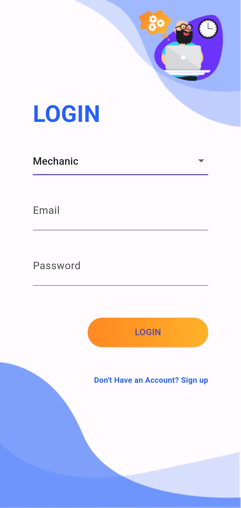
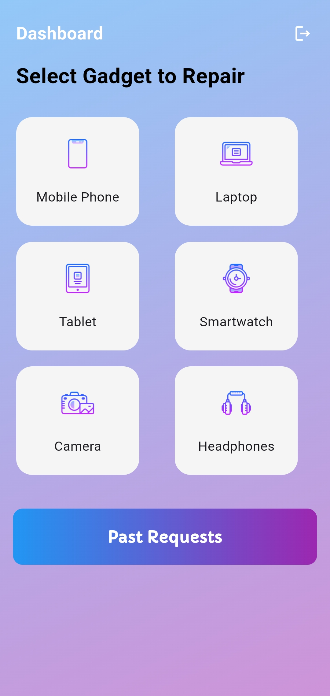
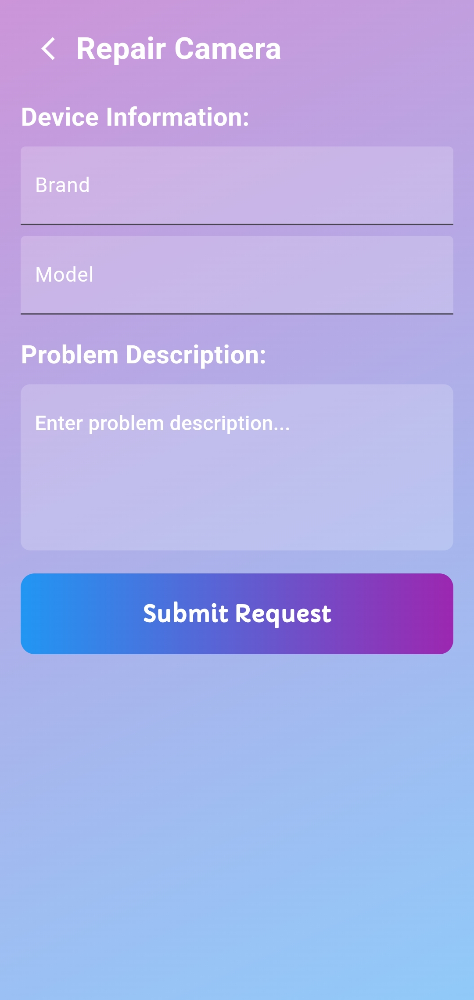
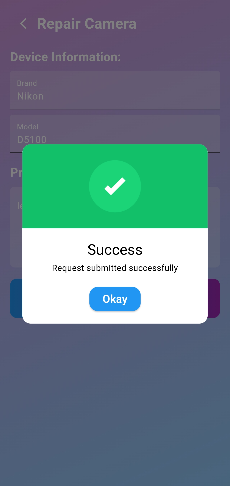
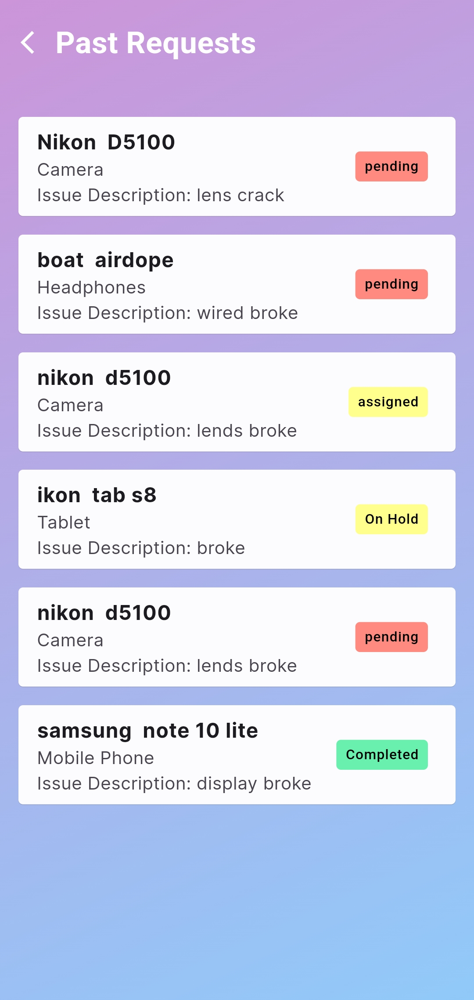

## Repair Service App Documentation

Welcome to the Repair Service App documentation. This document provides an overview of the app's features, architecture, and usage instructions.

### App Screenshots

**Login Signup**
<div style="display:flex;">
  
  
</div>

**Customer Screens**
<div style="display:flex;">
  
  
  
    
</div>

**Owner Screens**
<div style="display:flex;">
  


### Overview

The Repair Service App is designed to streamline the process of managing repair requests for mechanics. It allows mechanics to view and manage repair requests assigned to them, update the status of requests, and communicate with clients efficiently.

### Features

1. **Mechanic Home Screen**: Displays new repair requests and completed requests.
2. **New Repair Requests Screen**: Lists repair requests that are pending or on hold, allowing mechanics to update their status.
3. **Completed Repair Requests Screen**: Displays a list of repair requests that have been marked as completed.
4. **Task Tiles**: Customizable tiles for displaying repair request details and options to update their status.
5. **Real-time Updates**: Utilizes Firestore's real-time database to ensure mechanics have access to the latest repair request information.
6. **Confirmation Dialogs**: Dialog boxes for confirming actions such as marking a repair request as completed.
7. **Responsive Design**: Designed to work seamlessly across different screen sizes and orientations.

### Architecture

The Repair Service App follows a client-server architecture, with the client implemented using Flutter for cross-platform compatibility and the server-side logic managed by Firebase Firestore.

- **Client-Side (Flutter)**: The client side of the app is built using the Flutter framework, which allows for efficient development of cross-platform mobile applications. It handles the user interface, user interactions, and communicates with the Firebase backend.
  
- **Server-Side (Firebase Firestore)**: The server side of the app is managed by Firebase Firestore, a NoSQL cloud database provided by Google Firebase. Firestore stores and syncs the app's data in real-time, enabling mechanics to receive instant updates on repair requests.

### How to Run

#### Installation

To run the Repair Service App, follow these steps to set up your development environment:

1. **Install Flutter**: Ensure you have Flutter SDK installed on your machine. You can download and install Flutter from the [official Flutter website](https://flutter.dev/docs/get-started/install).

2. **Set Up an IDE**: Choose your preferred IDE for Flutter development. Popular options include Android Studio, Visual Studio Code, and IntelliJ IDEA. Install the necessary plugins/extensions for Flutter development in your chosen IDE.

3. **Clone the Project Repository**: Clone the project repository from <a>https://github.com/Vishnu-Deepan/repair-service</a> to your local machine using Git or by downloading the ZIP file.

   ```bash
   git clone https://github.com/Vishnu-Deepan/repair-service
   ```

4. **Navigate to the Project Directory**: Open a terminal/command prompt window and navigate to the root directory of the cloned project.

   ```bash
   cd repair_service
   ```

5. **Install Dependencies**: Run the following command to install the dependencies required for the project using Flutter's package manager, pub:

   ```bash
   flutter pub get
   ```

#### Running the App

Once you have completed the installation steps, you can run the Repair Service App on an emulator or connected device:

1. **Start Emulator or Connect Device**: Start an Android emulator or connect a physical device to your development machine.

2. **Run the App**: Use the following command to build and run the app on the emulator or connected device:

   ```bash
   flutter run
   ```

3. **Explore the App**: Once the app is running, you can explore its features and functionality.

### Note:

- Ensure you have a stable internet connection during the initial setup to download dependencies and packages.
- Make sure your development environment meets the [minimum requirements](https://flutter.dev/docs/get-started/install) for running Flutter apps.

---
